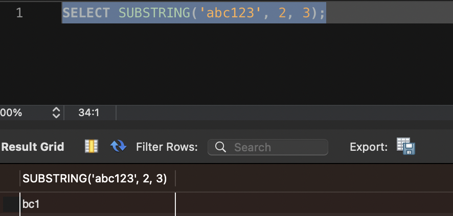
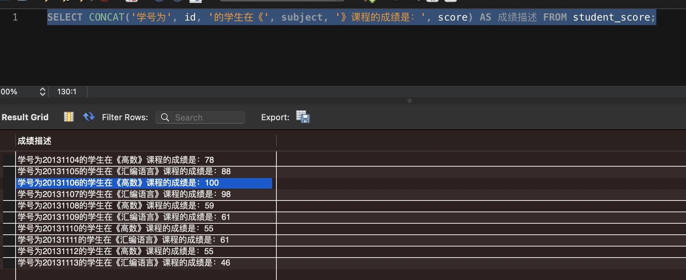
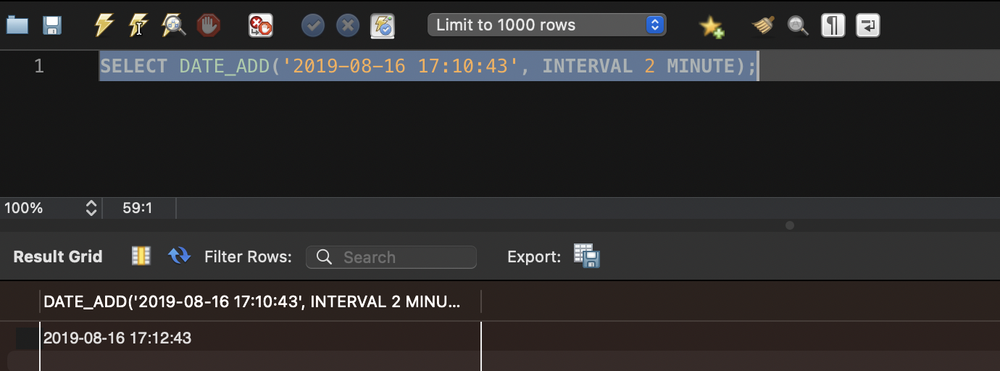
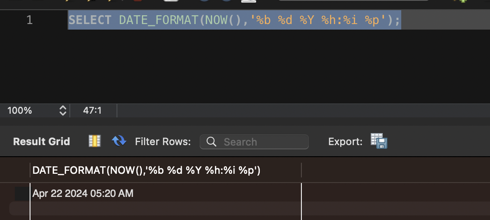
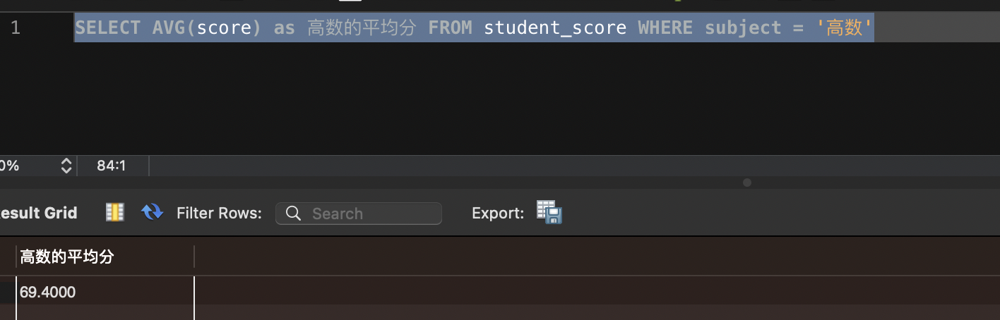
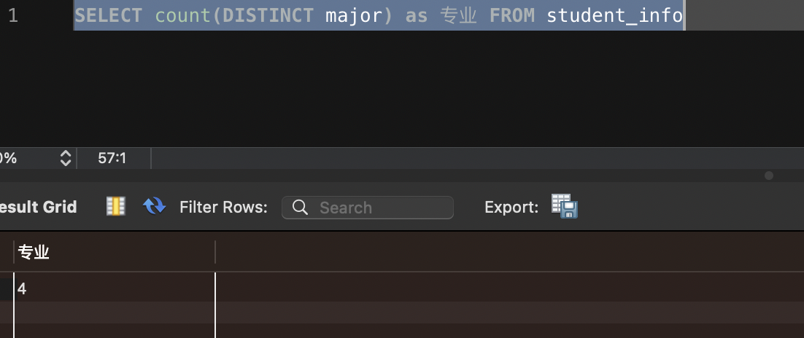
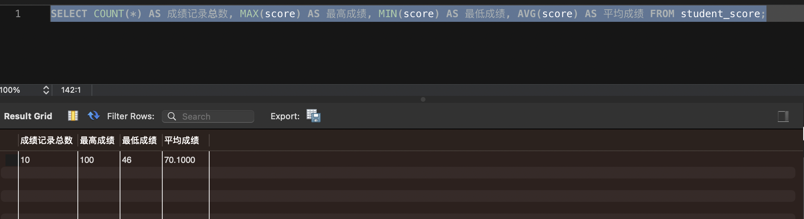

# 函数

### 文本处理函数
| 名称 | 调用示例 | 示例结果 | 描述 |
| --- | --- | --- | --- |
| LEFT | LEFT('abc123', 3) | abc | 给定字符串从左边取指定长度的子串 |
| RIGHT | RIGHT('abc123', 3) | 123 | 给定字符串从右边取指定长度的子串 |
| LENGTH | LENGTH('abc') | 3 | 给定字符串的长度 |
| LOWER | LOWER('ABC') | abc | 给定字符串的小写格式 |
| UPPER | UPPER('abc') | ABC | 给定字符串的大写格式 |
| LTRIM | LTRIM(' abc') | abc | 给定字符串左边空格去除后的格式 |
| RTRIM | RTRIM('abc ') | abc | 给定字符串右边空格去除后的格式 |
| SUBSTRING | SUBSTRING('abc123', 2, 3) | bc1 | 给定字符串从指定位置截取指定长度的子串 |
| CONCAT | CONCAT('abc', '123', 'xyz') | abc123xyz | 将给定的各个字符串拼接成一个新字符串 |
> 

> 

### 日期和时间处理函数
| 名称 | 调用示例 | 示例结果 | 描述 |
| --- | --- | --- | --- |
| NOW | NOW() | 2024-04-22 04:59:21 | 返回当前日期和时间 |
| CURDATE | CURDATE() | 2024-04-22 | 返回当前日期 |
| CURTIME | CURTIME() | 05:05:02 | 返回当前时间 |
| DATE | DATE('2019-08-16 17:10:43') | 2019-08-16 | 将给定日期和时间值的日期提取出来 |
| DATE_ADD | DATE_ADD('2019-08-16 17:10:43', INTERVAL 2 DAY) | 2019-08-18 17:10:43 | 将给定的日期和时间值添加指定的时间间隔 |
| DATE_SUB | DATE_SUB('2019-08-16 17:10:43', INTERVAL 2 DAY) | 2019-08-14 17:10:43 | 将给定的日期和时间值减去指定的时间间隔 |
| DATEDIFF | DATEDIFF('2019-08-16', '2019-08-17') | -1 | 返回两个日期之间的天数（负数代表前一个参数代表的日期比较小） |
| DATE_FORMAT | DATE_FORMAT(NOW(),'%m-%d-%Y') | 08-16-2019 | 用给定的格式显示日期和时间 |

#### 使用这些函数时需要注意一些地方
- 在使用DATE_ADD和DATE_SUB这两个函数时需要注意，增加或减去的时间间隔单位可以自己定义
    
    | 时间单位 | 描述 |
    | --- | --- |
    | MICROSECOND | 毫秒 |
    | SECOND | 秒 |
    | MINUTE | 分钟 |
    | HOUR | 小时 |
    | DAY | 天 |
    | WEEK | 星期 |
    | MONTH | 月 |
    | QUARTER | 季度 |
    | YEAR | 年 |

    让2019-08-16 17:10:43这个时间值增加2分钟
    > 

- 在使用DATE_FORMAT函数时需要注意，可以通过一些所谓的格式符来自定义日期和时间的显示格式

    | 格式符 | 描述 |
    | --- | --- |
    | %b | 简写的月份名称（Jan、Feb、...、Dec) |
    | %D | 带有英文后缀的月份中的日期（0th、1st、2nd、...、31st)） |
    | %d | 数字格式的月份中的日期(00、01、02、...、31) |
    | %f | 微秒（000000-999999） |
    | %H | 二十四小时制的小时 (00-23) |
    | %h | 十二小时制的小时 (01-12) |
    | %i | 数值格式的分钟(00-59) |
    | %M | 月份名（January、February、...、December） |
    | %m | 数值形式的月份(00-12) |
    | %p | 上午或下午（AM代表上午、PM代表下午） |
    | %S | 秒(00-59) |
    | %s | 秒(00-59) |
    | %W | 星期名（Sunday、Monday、...、Saturday） |
    | %w | 周内第几天 （0=星期日、1=星期一、 6=星期六） |
    | %Y | 4位数字形式的年（例如2019） |
    | %y | 2位数字形式的年（例如19） |

    把想要的显示格式用对应的格式符描述出来
    > 

### 数值处理函数
| 名称 | 调用示例 | 示例结果 | 描述 |
| --- | --- | --- | --- |
| ABS | ABS(-1) | 1 | 取绝对值 |
| Pi | PI() | 3.141593 | 返回圆周率 |
| COS | COS(PI()) | -1 | 返回一个角度的余弦 |
| EXP | EXP(1) | 2.718281828459045 | 返回e的指定次方 |
| MOD | MOD(5,2) | 1 | 返回除法的余数 |
| RAND | RAND() | 0.7537623539136372 | 返回一个随机数 |
| SIN | SIN(PI()/2) | 1 | 返回一个角度的正弦 |
| SQRT | SQRT(9) | 3 | 返回一个数的平方根 |
| TAN | TAN(0) | 0 | 返回一个角度的正切 |

### 聚集函数
| 函数名 | 描述 |
| --- | --- |
| COUNT | 返回某列的行数（1.COUNT(*)：对表中行的数目进行计数，不管列的值是不是NULL，2.COUNT(列名)：对特定的列进行计数，会忽略掉该列为NULL的行） |
| MAX | 返回某列的最大值 |
| MIN | 返回某列的最小值 |
| SUM | 返回某列值之和 |
| AVG | 返回某列的平均值 |

- 给定搜索条件下聚集函数的使用
    > 聚集函数并不是一定要统计一个表中的所有记录，也可以指定搜索条件来限定这些聚集函数作用的范围。比方说我们只想统计'高数'这门课程的平均分可以这么写
       

- 聚集函数中DISTINCT的使用
    > 聚集函数将计算指定列的所有非NULL数据，如果指定的列中有重复数据的话，可以选择使用DISTINCT来过滤掉这些重复数据
       

### 组合聚集函数
 > 聚集函数也可以集中在一个查询中使用
      