# 带搜索条件的查询

### 比较操作符
|操作符 | 示例 | 描述 |
| --- | --- | --- |
| = | a = b | a等于b |
| <> 或 != | a <> b | a不等于b |
| < | a < b | a小于b |
| <= | a <= b | a小于或等于b |
| > | a > b | a大于b |
| >= | a >= b | a大于或等于b |
| BETWEEN | a BETWEEN b AND c | 满足 b <= a <= c |
| NOT BETWEEN | a NOT BETWEEN b AND c | 不满足 b <= a <= c |

### 简单的查询条件
- 查询学号大于20131107的学生信息
> 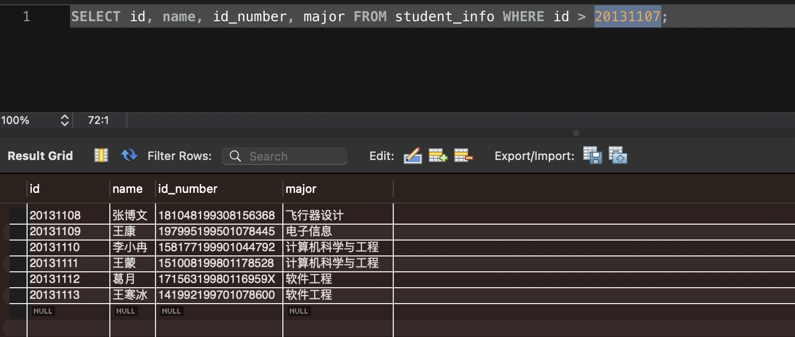

- 查询专业不是计算机科学与工程的一些学生信息
> 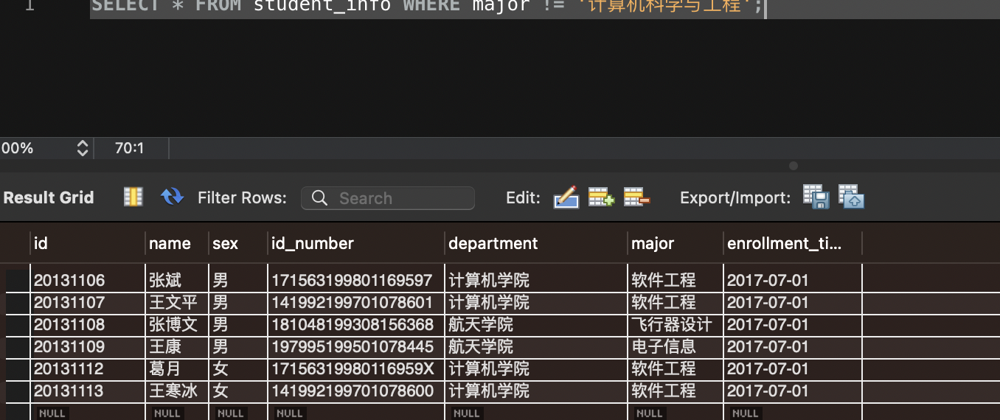

- 查询学号在20131107~20131109间的学生信息
> 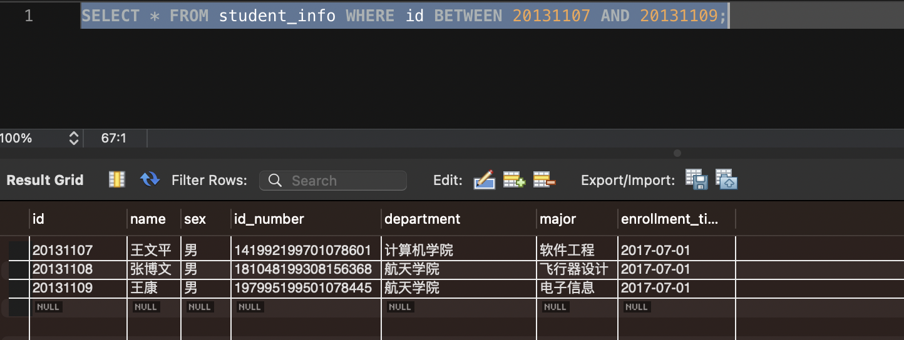

- 查询专业不是计算机科学与工程的一些学生信息
> 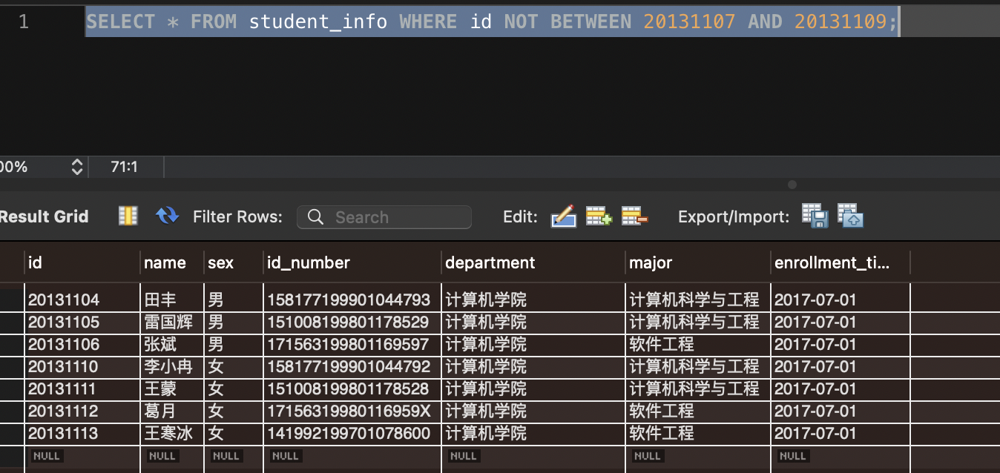

### 匹配列表中的元素
> 有时候搜索条件中指定的匹配值并不是单个值，而是一个列表，只要匹配到列表中的某一项就算匹配成功，这种情况可以使用IN操作符

|操作符 | 示例 | 描述 |
| --- | --- | --- |
| IN | a IN (b1, b2, ...) | a是b1, b2, ... 中的某一个 |
| NOT IN | a NOT IN (b1, b2, ...) | a不是b1, b2, ... 中的任意一个 |
> 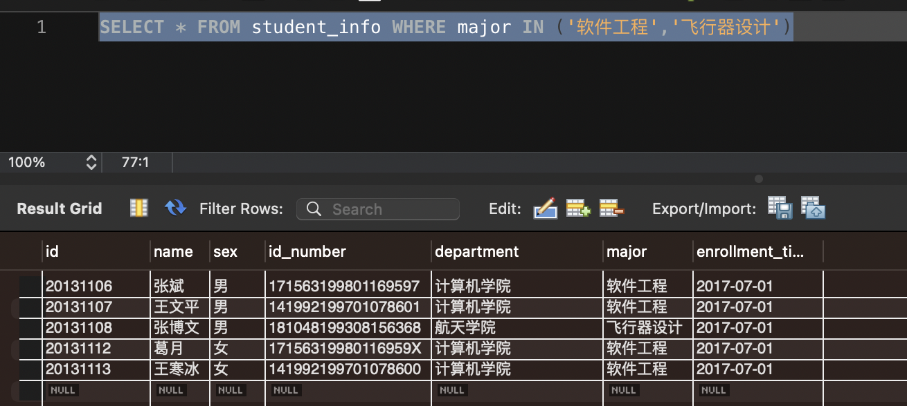
> 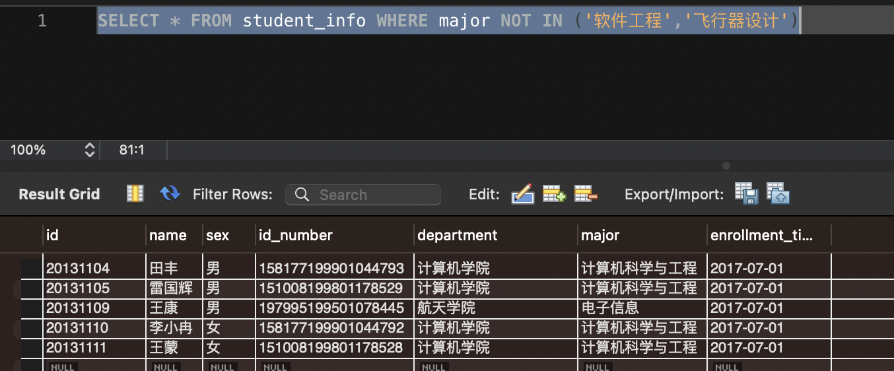

### 匹配 NULL 值
> 有时候搜索条件中指定的匹配值并不是单个值，而是一个列表，只要匹配到列表中的某一项就算匹配成功，这种情况可以使用IN操作符

|操作符 | 示例 | 描述 |
| --- | --- | --- |
| IS NULL | a IS NULL | a的值是NULL |
| IS NOT NULL | a IS NOT NULL | a的值不是NULL |
```
SELECT number, name, id_number, major FROM student_info WHERE name IS NULL;
```

### 多个搜过条件的查询
> 上边介绍的都是指定单个的搜索条件的查询，我们也可以在一个查询语句中指定多个搜索条件

- AND操作符
> 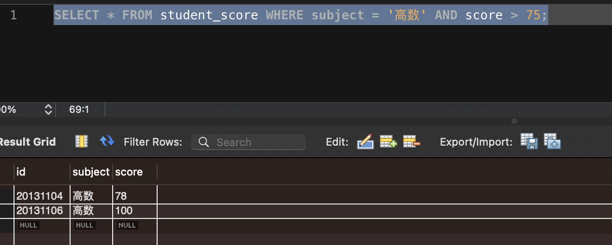

- OR操作符
> 

- 更复杂的搜索条件的组合
> AND操作符的优先级高于OR操作符，也就是说在判断某条记录是否符合条件时会先检测AND操作符两边的搜索条件
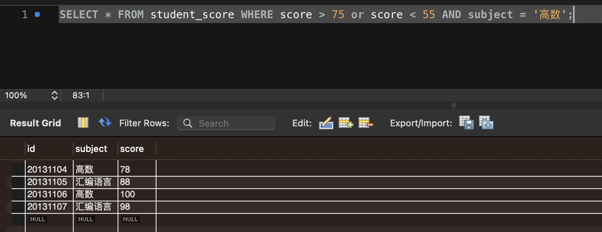

> 在一个查询中有多个搜索条件时最好使用小括号()来显式的指定各个搜索条件的检测顺序
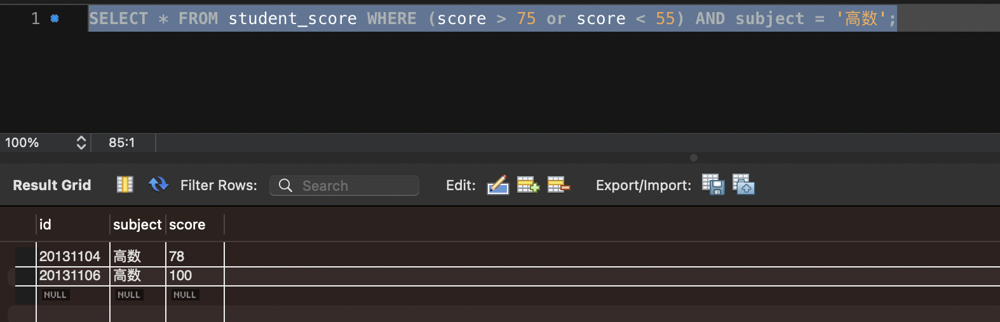

### 通配符
|操作符 | 示例 | 描述 |
| --- | --- | --- |
| LIKE | a LIKE b | a匹配b |
| NOT LIKE |a NOT LIKE b | a不匹配b |
- _只能代表一个字符，%是代表任意一个字符串
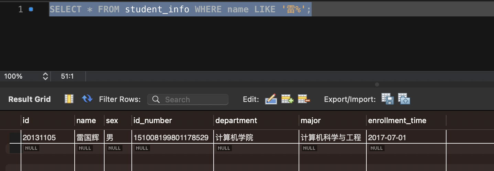
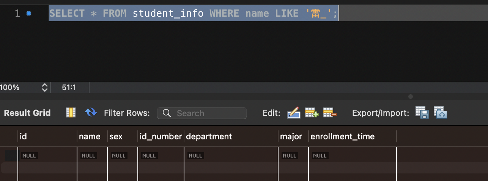

### 转义通配符
> 如果匹配字符串中需要普通字符'%'或者'_'的话，需要在它们前边加一个反斜杠 \ 来和通配符区分开来
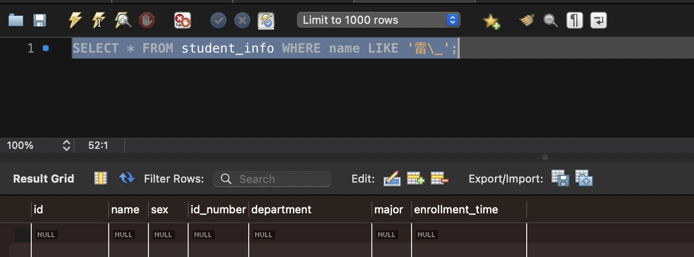


