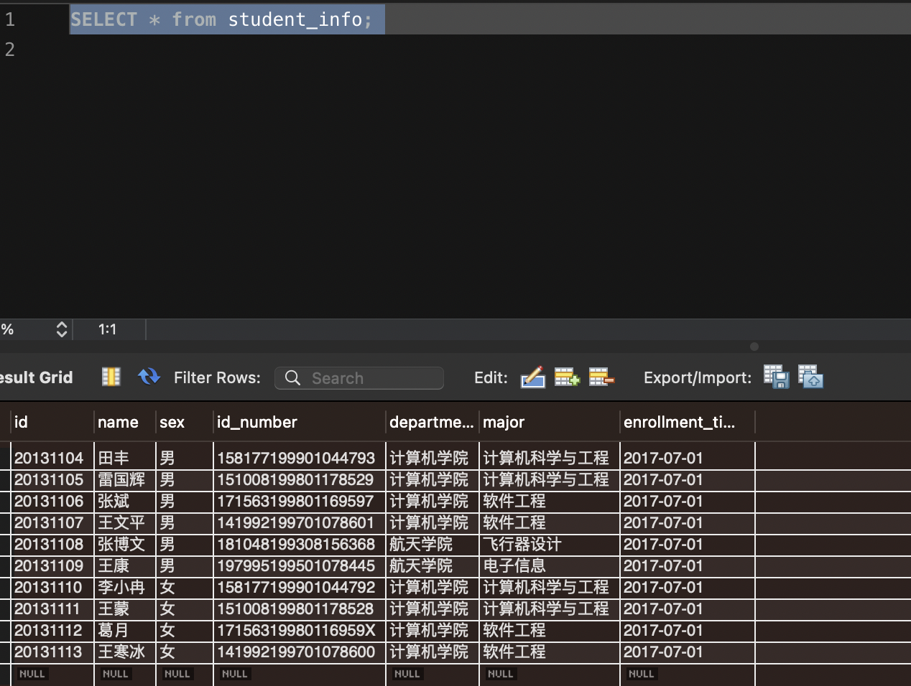
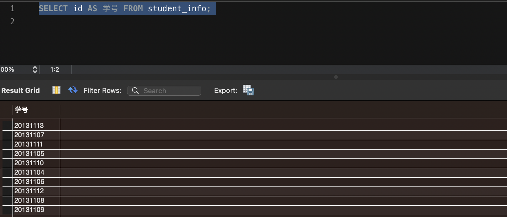
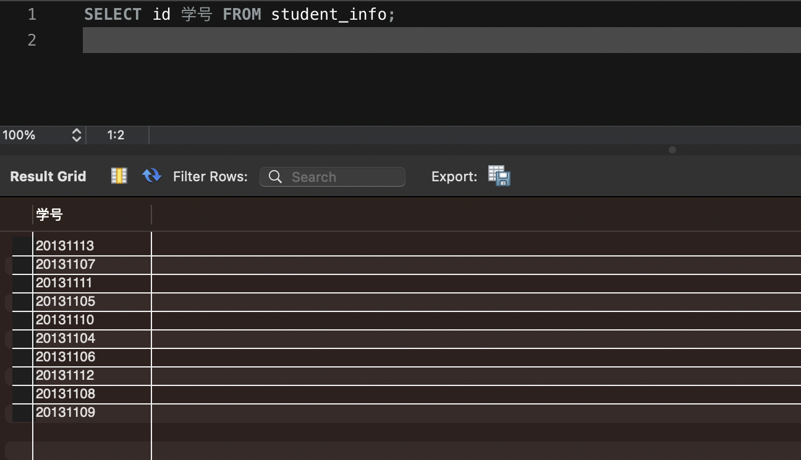
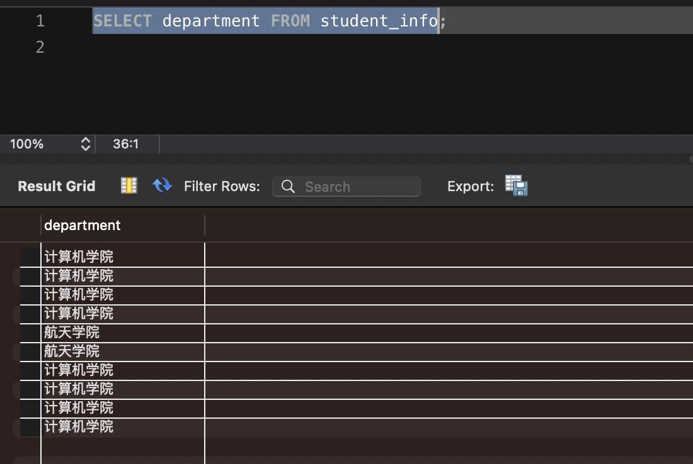
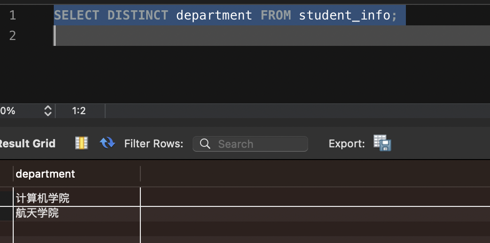
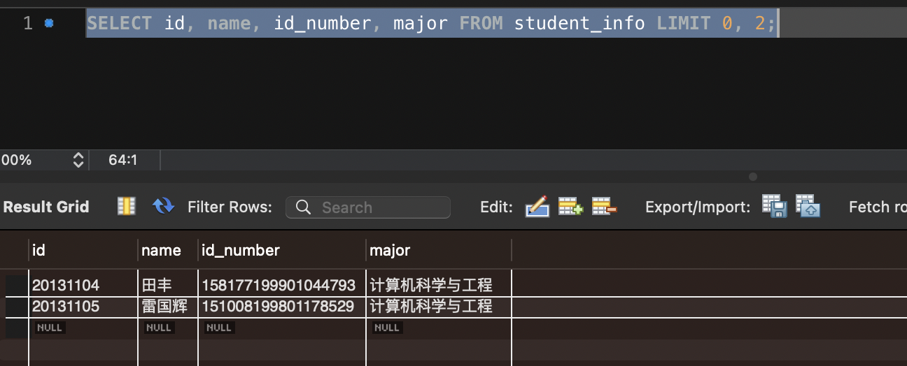
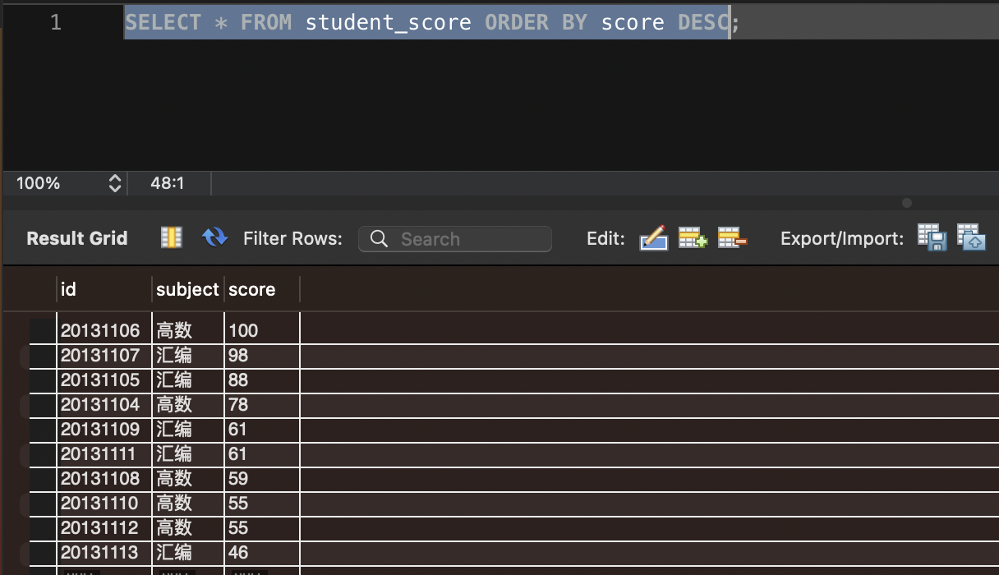
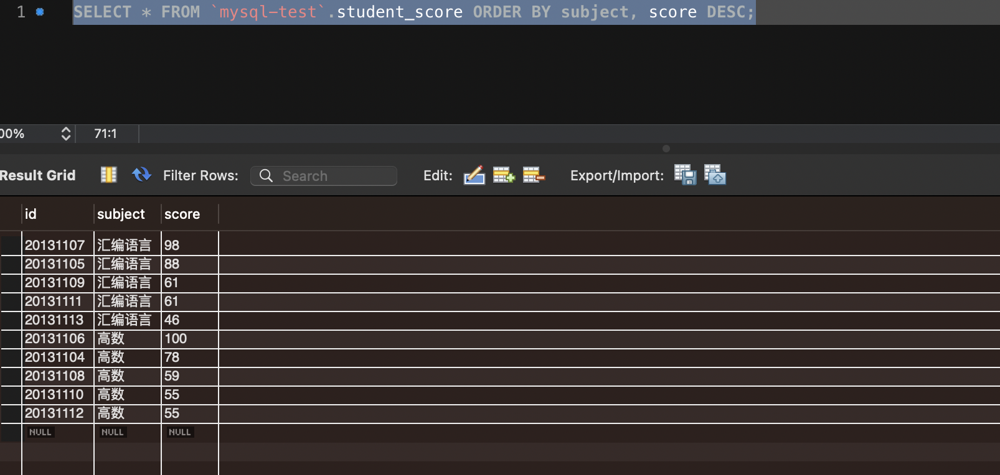

# 简单查询

### 创建数据库 
```
CREATE DATABASE IF NOT EXISTS mysql-test;
```

### 切换数据库
```
USE xiaohaizi;
```

### 创建学生信息表和学生成绩表
```
CREATE TABLE student_info (
    id INT PRIMARY KEY,
    name VARCHAR(5),
    sex ENUM('男', '女'),
    id_number CHAR(18),
    department VARCHAR(30),
    major VARCHAR(30),
    enrollment_time DATE,
    UNIQUE KEY (id_number)
);

CREATE TABLE student_score (
    id INT,
    subject VARCHAR(30),
    score TINYINT,
    PRIMARY KEY (id, subject),
    CONSTRAINT FOREIGN KEY(id) REFERENCES student_info(id)
);

 ```

### 填充数据
```
INSERT INTO student_info(id, name, sex, id_number, department, major, enrollment_time) VALUES
    (20131104, '田丰', '男', '158177199901044793', '计算机学院', '计算机科学与工程', '2017-07-01'),
    (20131105, '雷国辉', '男', '151008199801178529', '计算机学院', '计算机科学与工程', '2017-07-01'),
    (20131106, '张斌', '男', '171563199801169597', '计算机学院', '软件工程', '2017-07-01'),
    (20131107, '王文平', '男', '141992199701078601', '计算机学院', '软件工程', '2017-07-01'),
    (20131108, '张博文', '男', '181048199308156368', '航天学院', '飞行器设计', '2017-07-01'),
    (20131109, '王康', '男', '197995199501078445', '航天学院', '电子信息', '2017-07-01'),
    (20131110, '李小冉', '女', '158177199901044792', '计算机学院', '计算机科学与工程', '2017-07-01'),
    (20131111, '王蒙', '女', '151008199801178528', '计算机学院', '计算机科学与工程', '2017-07-01'),
    (20131112, '葛月', '女', '17156319980116959X', '计算机学院', '软件工程', '2017-07-01'),
    (20131113, '王寒冰', '女', '141992199701078600', '计算机学院', '软件工程', '2017-07-01');
        
INSERT INTO student_score (id, subject, score) VALUES
    (20131104, '高数', 78),
    (20131105, '汇编', 88),
    (20131106, '高数', 100),
    (20131107, '汇编', 98),
    (20131108, '高数', 59),
    (20131109, '汇编', 61),
    (20131110, '高数', 55),
    (20131111, '汇编', 61),
    (20131112, '高数', 55),
    (20131113, '汇编', 46);
```

### 查询全部、单个、多个列
```
SELECT * FROM 表名;
SELECT 列名 FROM 表名;
SELECT 列名1, 列名2, ... 列名n FROM 表名;
```
> 

### 列的别名
- 方式一
```
SELECT number AS 学号 FROM student_info;
```
> 

- 方式二
```
SELECT number 学号 FROM student_info;
```
> 

### 去除列单列或多列的重复结果
```
SELECT DISTINCT 列名1, 列名2, ... 列名n  FROM 表名;
```
> 
> 

### 限制查询结果条数
```
LIMIT 开始行, 限制条数; （开始航可以省略，默认从0行开始）
```
> 

### 对查询结果排序
#### 如果不指定排序方向，则默认使用的是ASC
- 方式一
```
ORDER BY 列名 ASC|DESC
```
> 

- 方式二
```
ORDER BY 列1 ASC|DESC, 列2 ASC|DESC ...
```
> 


