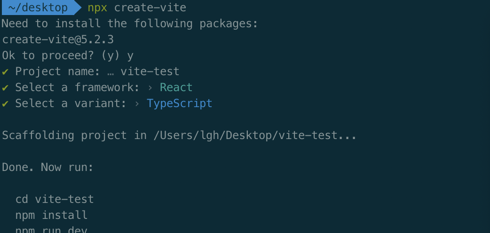
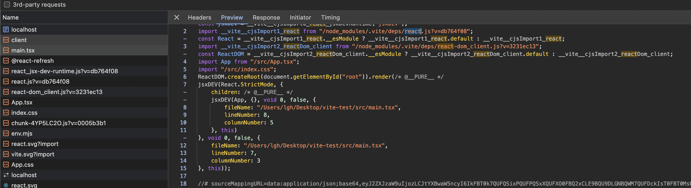
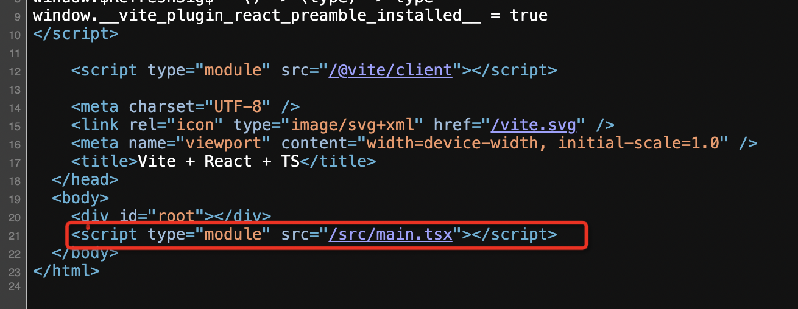
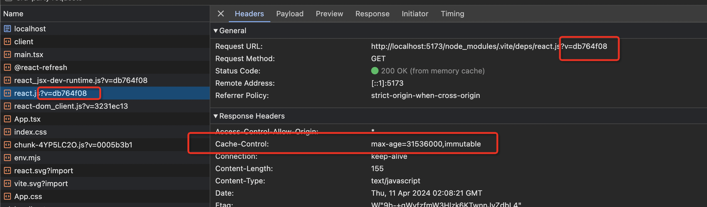
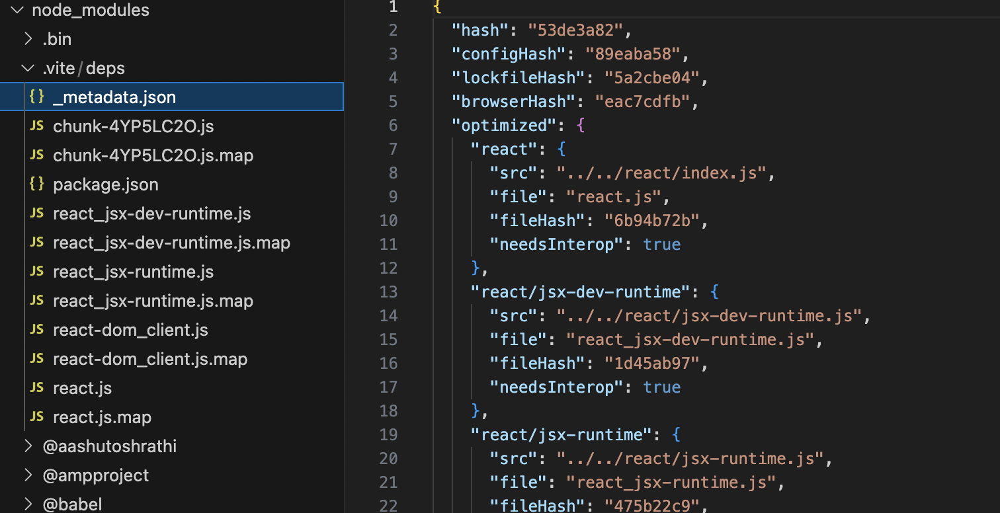

# Vite

1.先创建vite项目 安装依赖并把服务跑起来
> 

2.将项目跑起来，在浏览器下访问
>  
可以看到main.tsx App.tsx 的依赖都是直接引入的，做了编译，没有打包

> 
 基于浏览器type为module的script实现的

3. vite在开发环境下起了一个做编译的服务器，根据script请求的URL找到对应的模块做编译，编译是通过不同插件完成的，插件就是一个对象，导出transform方法，有一个 import-anlysis插件 会分析模块依赖，继续处理其他模块的编译,这就是vite的no boundle方案，在请求的时候对模块做编译

4. 浏览器支持es module的import，如果node_modules下的依赖有用commonjs规范的代码呢
> 这种就需要提前做一些转换，把coomonjs转成es module模块

5. 紧接着上个问题，如果每个模块都是请求时编译，node_modules下的包会随着依赖的增加而越来越多，很容易就会有成千上万个请求，怎么办
> 
vite加了一个预构建功能pre bundle，在启动完开发服务器的时候，立刻对node_modules下的代码做打包，会扫描出所有的依赖打包，然后将依赖打平放到node_modules/.vite/deps下，

6. 那是不是每次启动都要重新预编译依赖呢
> 
node_modules/.vite还会生成一个_metadata.json文件,vite会在预打包的模块后加一个query字符串，然后用max-age强缓存，在对应的依赖有变化时，重新预编译，然后在资源请求时带上新的quey，让强缓存失效