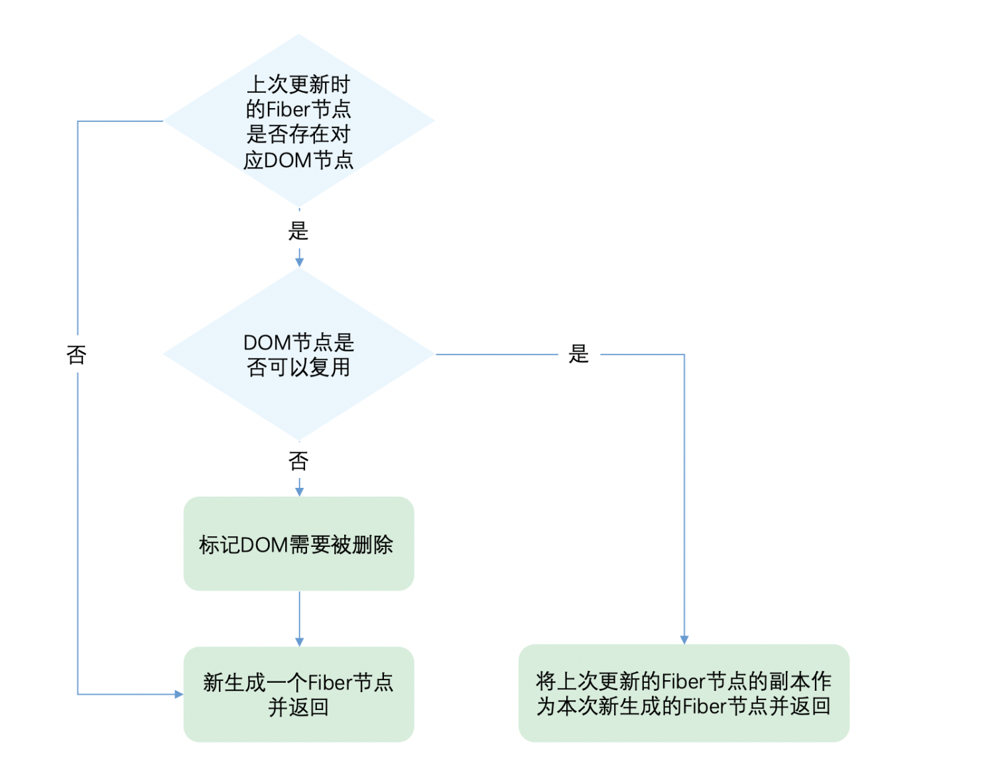

# diff算法
> 将俩颗树对比的算法复杂度为O(n^3)，1000个元素执行的计算量将在十亿的量级范围，开销太大，

### 为了降低算法复杂度，React的diff会预设三个限制
- 只对同级元素进行Diff。如果一个DOM节点在前后两次更新中跨越了层级，那么React不会尝试复用它
- 两个不同类型的元素会产生出不同的树。如果元素由div变为p，React会销毁div及其子孙节点，并新建p及其子孙节点
- 开发者可以通过 key prop来暗示哪些子元素在不同的渲染下能保持稳定
```
// 更新前
<div>
  <p key="ka">ka</p>
  <h3 key="song">song</h3>
</div>

// 更新后
<div>
  <h3 key="song">song</h3>
  <p key="ka">ka</p>
</div>

// 如果没有key，React会认为div的第一个子节点由p变为h3，第二个子节点由h3变为p。这符合限制2的设定，会销毁并新建。
// 但是当我们用key指明了节点前后对应关系后，React知道key === "ka"的p在更新后还存在，所以DOM节点可以复用，只是需要交换下顺序

```

### Diff的实现
Diff的入口函数reconcileChildFibers出发，该函数会根据newChild（即JSX对象）类型调用不同的处理函数
> [reconcileChildFibers](https://github.com/facebook/react/blob/1fb18e22ae66fdb1dc127347e169e73948778e5a/packages/react-reconciler/src/ReactChildFiber.new.js#L1280)的源码
```
// 根据newChild类型选择不同diff函数处理
function reconcileChildFibers(
  returnFiber: Fiber,
  currentFirstChild: Fiber | null,
  newChild: any,
): Fiber | null {

  const isObject = typeof newChild === 'object' && newChild !== null;

  if (isObject) {
    // object类型，可能是 REACT_ELEMENT_TYPE 或 REACT_PORTAL_TYPE
    switch (newChild.$$typeof) {
      case REACT_ELEMENT_TYPE:
        // 调用 reconcileSingleElement 处理
      // // ...省略其他case
    }
  }

  if (typeof newChild === 'string' || typeof newChild === 'number') {
    // 调用 reconcileSingleTextNode 处理
    // ...省略
  }

  if (isArray(newChild)) {
    // 调用 reconcileChildrenArray 处理
    // ...省略
  }

  // 一些其他情况调用处理函数
  // ...省略

  // 以上都没有命中，删除节点
  return deleteRemainingChildren(returnFiber, currentFirstChild);
}
```
我们可以从同级的节点数量将Diff分为两类：

- 当newChild类型为object、number、string，代表同级只有一个节点
- 当newChild类型为Array，同级有多个节点

### 单节点diff
单个节点，我们以类型object为例，会进入reconcileSingleElement（string number类型调用reconcileSingleTextNode），
>  [reconcileSingleElement](https://github.com/facebook/react/blob/1fb18e22ae66fdb1dc127347e169e73948778e5a/packages/react-reconciler/src/ReactChildFiber.new.js#L1141)的源码

这个函数会做如下事情：

首先判断上次更新时的fiber节点是否存在对应DOM节点，如果不存在，则新生成一个fiber节点并返回，如果存在，则判断DOM是否可以复用(，React通过先判断key是否相同，如果key相同则判断type是否相同，只有都相同时一个DOM节点才能复用)，如果可以复用，将上次更新的fiber节点的副本作为本次新生成的Fiber节点并返回，如果不能复用，标记DOM需要删除，新生成一个fiber节点并返回

