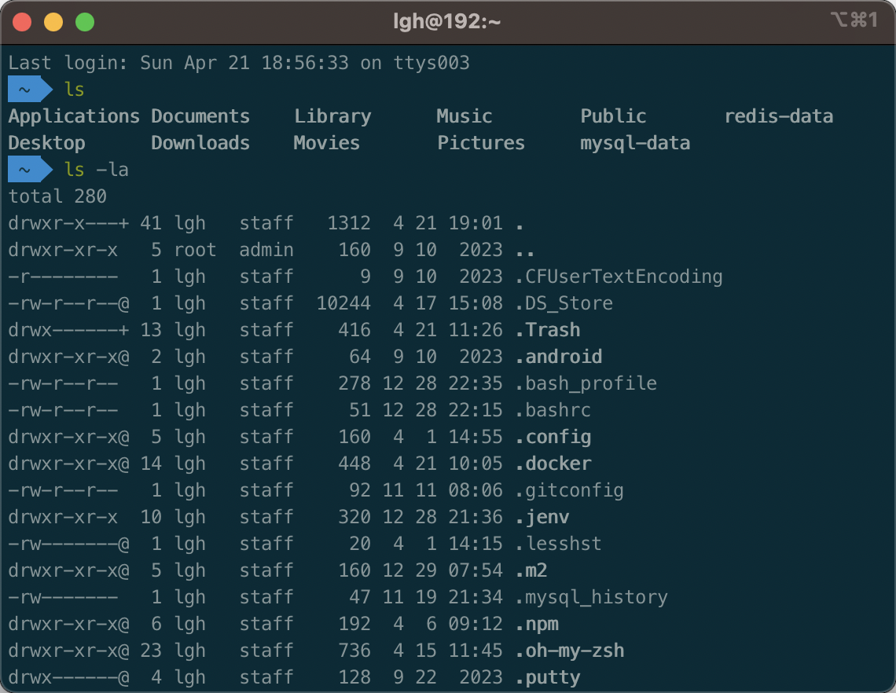

# 常用的 linux 命令

### linux 系统是一种多用户系统
- 文件所有者（Owner）
- 群组（Group）
- 其他人（Others）
- 超级用户（Root）

###  ls 列出文件和目录
- ls 列出文件和目录
- ls -la 由 -a 显示所有文件和目录（包括隐藏）和 -l 显示详细列表组成
> 

| 文件类型和权限信息 | 链接数或者一级子目录数 | 所有者 | 所属组 | 文件大小,单位字节 | 最后修改时间 | 文件名 |
| --- | --- | --- | --- | --- | --- | --- |
| drwxrwxr-x | 5 | lgh | staff | 50 | 4 21 19:01 | .docker |

> 重点看第 1 列的内容，以 drwxrwxr-x 为例，这里一共 10 位，第 1 位表示文件类型，其中 - 表示普通文件，d 表示目录文件。
第 2 到第 4 位，表示所有者权限，其中 r 表示读权限，w 表示写权限，x 表示可执行权限， -表示无权限，第 2 到 5 位为 rwx，表示所有者可读可写可执行。
第 5 到第 7 位，表示组用户权限，这里也是 rwx。
第 8 到第 10 位，表示其他用户权限，这里是 r-x，表示有可读可执行权限，无写入权限。
> root 用户创建文件夹的默认权限为 rwxr-xr-x, 而创建文件的默认权限是 rw-r--r--，注意创建文件默认会去掉 x 权限

### chown 更改文件属主，也可以同时更改文件属组
#### chown (change owner) 语法：
```
# -R：递归更改文件属组
chown [–R] 属主名 文件名
chown [-R] 属主名：属组名 文件名

将 index.html 的所有者更改为 git：
chown git index.html
-rw-r--r-- 1 git  root  0 12月 17 23:54 index.html

将 index.html 的所有者和群组都改为 git：
chown git:git index.html
-rw-r--r-- 1 git  git   0 12月 17 23:54 index.html
```

### chmod 更改文件权限
#### 权限除了用 r w x 这种方式表示，也可以用数字表示，数组与字母的对应关系为
- r:4
- w:2
- x:1
> 我们希望一个文件可读可写，那我们可以方便的设置权限为 6（4 + 2），同样，如果我们知道一个权限为 3，我们也可以推导出权限为可写可执行，因为只有 2 + 1 才可能等于 3
#### chmod （change mode） 的具体语法
```
# -R：递归更改文件属组
chmod [-R] xyz 文件或目录
其中 xyz 分别表示 Owner、Group、Others 的权限，如果我们这样设置一个文件的权限
chmod 750 index.html
Owner 的权限为 7，为可读可写可执行，Group 的权限为 5，为可读可执行，Others 的权限为 0，表示不可读写不可执行。对应字母为：rwxr-x---

除了这种数字的方式，还有一种使用符号类型改变权限的方式
在这种方式里，我们将三种身份 Owner、Group、Others，分别简写为 u（User）、g、o，用 a 表示所有身份，再使用 + - = 表示加入、去除、设定一个权限，r w x 则继续表示读，写，执行权限
chmod u+x,g-x,o-x index.html
意思就是 Owner 加上执行权限，Group 和 Others 去除执行权限。
当然我们也可以直接设定权限
chmod u=rwx,g=rx,o=r index.html
此时文件的权限就相当于 -rwxr-xr--。

此外，我们还可以省略不写 ugoa 这类身份内容，直接写：
chmod +x index.html
此时相当于使用了 a，会给所有身份添加执行权限
```

### su 切换身份
```
# 切换为 git 用户
su git
```

### whoami 显示用户名
```
# whoami 
root
```

### mkdir 创建目录
```
mkdir new_folder
mkdir -p one/two/three // mkdir -p 递归创建目录
```

### echo 打印输出
```
echo "\"test content\""

创建或覆盖文件内容为 "test content"：
echo "test content" > index.html

如果是想追加内容，就用 >> ：
echo "test content" > index.html
```

### cat 连接文件并打印输出
```
查看文件内容：
cat ~/.ssh/id_rsa.pub

清空 index.html 内容：
cat /dev/null > index.html

把 index.html 的内容写入 second.html：
cat index.html > second.html

把 index.html 的内容追加写入 second.html：
cat index.html >> second.html

把 index.html 和 second.html 追加写入 third.html：
cat index.html second.html >> third.html
```

###  cp 复制文件或目录
```
将目录 website/ 下的所有文件复制到新目录 static 下
# -r：若给出的源文件是一个目录文件，此时将复制该目录下所有的子目录和文件。
cp –r website/ static
```

### mv 移动并重命名
```
文件改名：
mv index.html index2.html

隐藏文件：
# 文件名上加上 .
mv index.html .index.html

移动文件：
# 仅仅移动
mv  /home/www/index.html   /home/static/
# 移动又重命名
mv /home/www/index.html   /home/static/index2.html

批量移动：
mv  /home/www/website/*  /home/www/static
```

### rm 删除一个文件或者目录​
```
# 系统会询问
rm file

# -f 表示直接删除
# -r 表示目录下的所有文件删除

# 删除当前目录下的所有文件及目录
rm -r  * 

# 跑路
rm -rf /*
```
